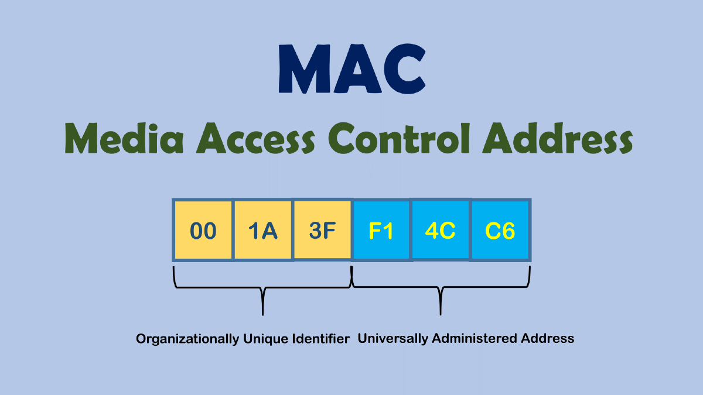

# MAC Addresses (Media Access Control)

- Layer 2 in the OSI Model
- A MAC Address is known as a Physical Address
    - Switches Use MAC Addresses
        - Anything that uses a Network Interface has a MAC Address

- The first three pairs identify the company that manufactured the network card
    - This can help you identify a device on the network
        - You can Google the pair to find this information