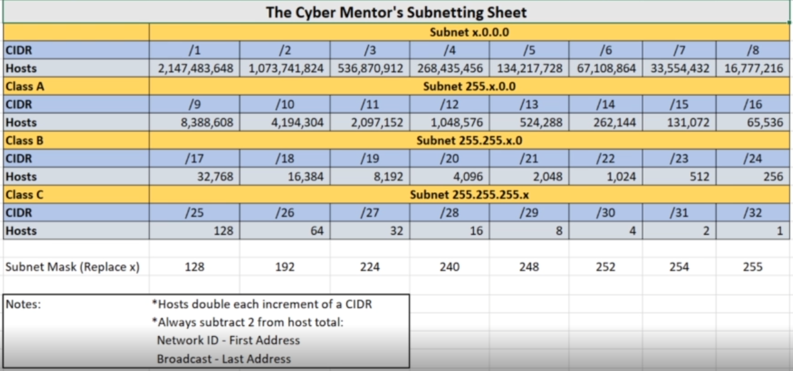
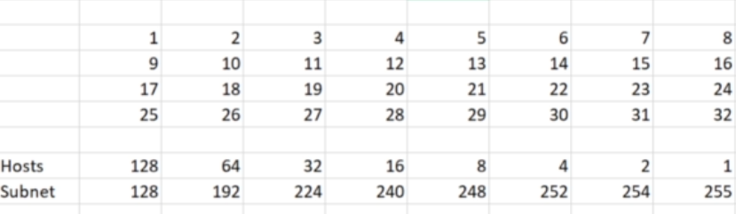

- Subnet Mask
    - Example
        - 255.255.255.0

 

- Can have the possibility of 32 bits on

- Need to Remove two IP Addresses from the  Equation
    - Network ID
        - Usually First Address
    - Broadcast IP
        - Usually Last Address
- Subnets can create many different networks for different devices and needs
- [IP Address Guide](/C:/Users/Damon/AppData/Local/Programs/Joplin/resources/app.asar/ipaddressguide.com)
    - Double check information

|     |     |     |     |     |
| --- | --- | --- | --- | --- |
|     | Subnet | Hosts | Network | Broadcast |
| 192.168.1.0/24 | 255.255.255.0 | 254 | 192.168.1.0 | 192.168.1.255 |
| 192.168.1.0/28 | 255.255.255.240 | 14  | 192.168.1.0 | 192.168.1.15 |
| 192.168.1.16/28 | 255.255.255.240 | 14  | 192.168.1.16 | 192.168.1.31 |
| 192.168.0.0/23 | 255.255.254.0 | 510 | 192.168.0.0 | 192.168.1.255 |
| 192.168.2.0/23 | 255.255.254.0 | 510 | 192.168.2.0 | 192.168.3.255 |
| 192.168.0.0/22 | 255.255.252.0 | 1,022 | 192.168.0.0 | 192.168.3.255 |
| 192.168.1.0/26 | 255.255.255.192 | 62  | 192.168.1.0 | 192.168.1.63 |
| 192.168.1.0/27 | 255.255.255.224 | 30  | 192.168.1.0 | 192.168.1.31 |