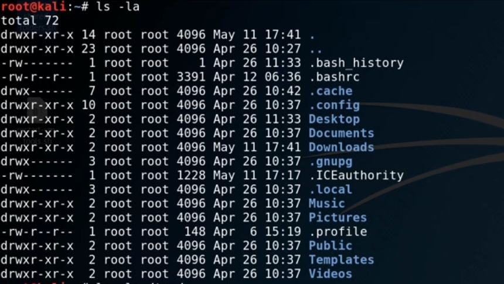

- drwxrwxrwxr
    - d or -
        - Directory or file
    - r
        - read
    - w
        - write
    - x
        - Execute
    - First Group Deals with the root user
    - Second Group Deals with Users within the Same Group
    - Third Group is All Other Users

## Change Mode

- chmod
    - Modify Permissions
    - chmod 777
        - Give full access
            - File turns green

## Add Users

- adduser

## Switch User

- su