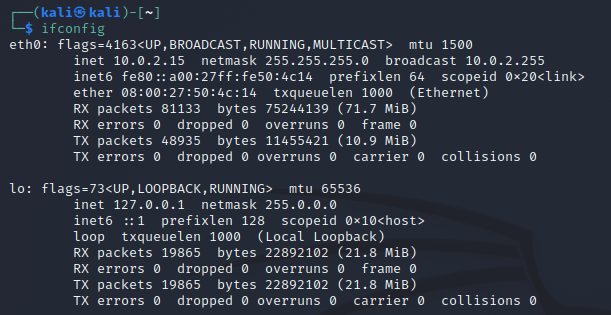
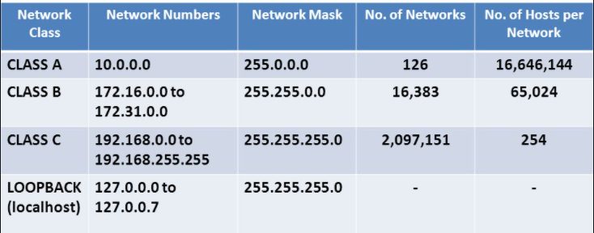

# IP Addresses

- Layer 3 in the OSI Model

## IPv4

- Most Common form
- Decimal Notation
- 32 Bits/4 Bytes
- Each Section is 8 Bits Stored in Binary
    - 11111111.11111111.11111111.11111111
    - 128 64 32 16 8 4 2 1
    - If all 1's then it is equal to 255
    - 128+64+32+16+8+4+2+1=255
        - Another Example is 00000111
            - That is 4+2+1=7
                - 2^32=4,294,967,296
                    - The number of possible IPv4 IP Addresses available
                        - We are out of IPv4 Addresses

## IPv6

- Hexadecimal Notation
- 128 Bits
- 2^128 = 3.403e+38
    - Will take a long time to fill all of this address space
    - Still not used as frequently as IPv4

## NAT (Network Address Translation)

- Most networks have multiple devices on a network
    - Different devices like phones, TVs laptops, and IoT devices
        - 192.168.0.0
            - Private IP Address
                - Can be passed out through a Public IP Address

- - Purchase IP Addresses from Your ISP
    - All Network traffic in a network goes out a single IP Address